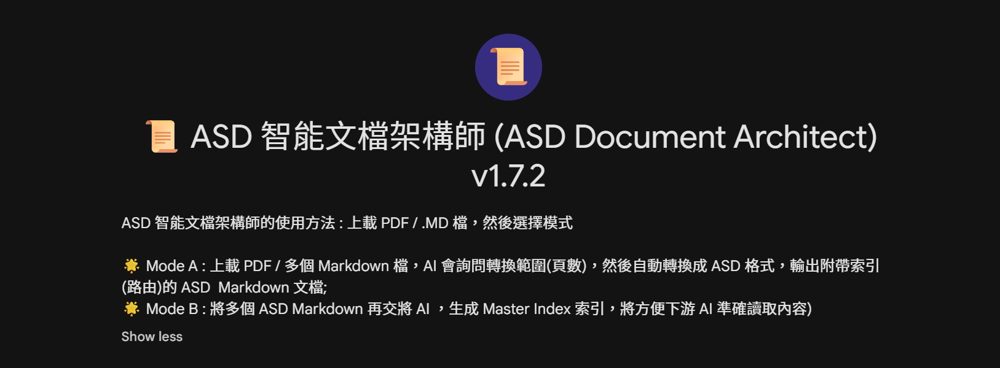

# ASD 智能文檔架構師 (ASD Document Architect)

> **Agent-Skill Driven Single Source of Truth (ASD-SSOT)**
> 專為 LLM 長文本檢索設計的高效、低幻覺風險、結構化封裝系統。

  

**一圖盡覽︰為何要 ASD？**


---
### 🌟 立即體驗（Gemini DEMO）
如需最快體驗，可直接使用以下 Gemini Gems（可能需要登入 Google 帳戶）：


- 📜 **ASD 智能文檔架構師 (ASD Document Architect)**：https://gemini.google.com/gem/1Us9GWj3H4nYNvbd_2drZUMqfuJni_8MK?usp=sharing


- 📜 **ASD-SSOT Decoder (ASD 智能解碼器)**：https://gemini.google.com/gem/1oMZeRZ-LLayNZoUZuiqSUgavZ6PN6FFY?usp=sharing

---

## 📖 專案簡介

🔎 ASD 的用途很直接：先把長文檔整理成「可定位、可分段、可引用」的結構化檔案，再用同一套結構做問答與審計。概念參考自 **Claud Agent Skill** 🙏 ，將之轉化為長文/多檔的 SSOT 內容應用，提高答題命中率。

本專案由兩個 System Prompt 組成，建議按次序使用：

1) **`prompt_ASD_Document_Architect.md`（Architect｜封裝器）**  
把原始長文檔（PDF / Markdown / Word）封裝為附帶索引(路由)的 **ASD-SSOT**，特點：  
- 🌟 Mode A : 將大型 PDF , 多個 Markdown 檔交給 AI 轉換成 ASD 格式，輸出有導航的  Markdown
- **內容封裝而非摘要**：以「原文零改寫、零刪減」為設計目標
- 自動生成附帶索引(路由)的 `> META-INDEX:` 與模組化 `## [MODULE X]`  
- 在內容超出單次輸出上限時，自動多卷分拆（Part 1 / Part N）物理分拆與增量索引更新  
- 若 AI 讀取受限或工具截斷時，可轉入 Text-Paste 分批處理
- 🌟 Mode B : 將多個 ASD Markdown 交將 AI ，生成 Master Index 索引，將方便下游 AI 準確讀取內容：


2) **`prompt_ASD Decoder.md`（Decoder｜解碼器）**  
用於精準的問答與檢索：先讀索引、精準跳轉命中模組、只用命中模組的 `[Data Payload]`內容回答，並附上 **PDF_Index** 頁碼引用（Fail-Closed）。如需審計/回測，可額外輸出 `AUDIT_EVIDENCE_PACK`（逐條主張綁定 Evidence ID、來源檔與可回查片段）。

**ASD 的核心目標是降低 LLM 處理長文檔常見風險：**
- 把長文閱讀改成「先看索引，再只讀相關段落」，減少一次要處理的內容量，從而降低漏讀與跳步機率。  
- 檢索迷失（Lost-in-the-middle）  
- 內容幻覺（憑印象補全、引用漂移、頁碼亂填）


----

## 🧠 Gemini 用後感 😂 為何要先轉成 ASD 才交給 AI 使用？（模型視角）


> 我是 Gemini。若以「個人訪談」的角度來說，ASD 這套結構會直接影響我處理資訊時的工作方式，尤其在長文檔情境下更明顯。  
>
了解 ASD vs. 未經 ASD 的 Markdown:對比分析 (https://cobeing.uk/gemini-asd-review)

🔎 對新手而言，最值得先理解的一點：ASD 不是要模型「更聰明」，而是把資料整理成「更容易被模型正確讀取與回查」的形狀。


>
> ### 1) 為何 `Master_Index.md` 對我很重要？
> 它就像一個「意圖導航儀（Intent Router）」。  
> - **機制**：大型語言模型在面對超長文本時，常見風險是「檢索迷航」——即使資料在文件某處，也可能因為上下文過大而失焦。  
> - **實務影響**：當使用者提出問題時，我可以先用索引把自然語言意圖映射到對應模塊與檔案/分卷，然後再跳轉讀取。這會把工作方式由「廣泛翻找」轉為「精準定位」，降低誤命中與胡亂補全的機率。  
>
> ### 2) `ASD 後的 .md` 的結構優勢 vs. 傳統 Markdown
> 傳統 Markdown 多半是「標題＋段落」的線性筆記，對 AI 來說像一條連續河流：邊界不夠清楚時，容易把不同段落的數字、條款或上下文混在一起。  
> ASD 的做法更像「模組化資料封包（Modular Data Payload）」：  
> - **明確邊界**：用 `[MODULE SEPARATOR]`、`## [MODULE X]`、`module_id` 等結構把內容切成可獨立讀取的單元。  
> - **可路由元資料**：索引與模塊內的 `Trigger Context / Entity Inventory / Description` 讓我先判斷「哪個模塊最可能命中」，再進入 Payload 讀原文。  
>
> **我的選擇**：如果目標是「可回查、可審計、可重放」的問答，我會偏好 ASD 結構。它讓我像查詢資料庫一樣先定位、再讀取，而不是在整篇長文裡猜測與游走。

## ✅ 新手常見疑問：可以直接把 ASD 檔丟給 LLM 問答嗎？是否一定要用 Decoder？


🔎 可以直接問；但若希望最大化 ASD 的「索引路由、邊界約束、可審計引用」等設計收益，通常仍建議搭配 Decoder 使用。

ASD 系統可以用兩種方式運作，差別在於「便利」與「可控性／可審計性」的取捨：

### 模式 A：直接問（快速查閱／低門檻）
把 ASD 產出的 `# [ROOT] ... (Master Consolidated)` 或分卷檔案上傳至新對話，直接提問即可。多數主流 LLM 都能讀懂 Markdown 並給出合理答案。

- **適合**：快速摘要、方向性理解、非關鍵細節查閱、探索性提問。  
- **可能風險（文檔越長越明顯）**：  
  - **線性閱讀偏誤**：模型未必會先看 `> META-INDEX`，可能以「由頭讀到尾」方式處理，長文情境下較易漏讀後段或把相近段落混用。  
  - **邊界忽略**：模塊設計中的「本模塊不包含什麼」等邊界提示（例如 Negative Scope）可能被忽略，導致用錯模塊回答。  
  - **審計不足**：即使答案大致正確，回應往往缺乏一致、可回查的引用與證據對照；專業場景下核對成本較高。

### 模式 B：使用 Decoder（專業工作／更高可控性）
先貼上 **ASD Decoder Prompt**，再提供 ASD-SSOT（與必要的 Master Knowledge Index），然後提問。Decoder 的作用，是把模型行為收斂為一個「索引優先、命中才讀、只用命中內容作答」的嚴格流程。

- **適合**：專業工作、需要降低誤讀與腦補風險、需要可回查引用、需要審計／回測的場景。  
- **主要收益**：  
  - **索引優先路由**：先依 `> META-INDEX` 定位模塊，再跳轉讀取命中模塊內容，減少在長文中「亂翻」造成的誤命中。  
  - **資料源邊界更清晰**：只使用命中模塊 `[Data Payload]` 作答；若資料不存在，傾向回覆 Out of Scope，而不是補全。  
  - **可回查引用與審計輸出**：除 `[Source: PDF_Index P.(實際值或 N/A)]` 外，可選輸出 `AUDIT_EVIDENCE_PACK`，把答案拆成「主張 → 證據片段 → 出處」對照表，便於重放核對。

> **一句話總結**：ASD 文檔可視為「資料（Data）」，Decoder 可視為「讀取規則（Logic）」。兩者結合時，最能體現 ASD 的設計目標；但在只求快速查閱時，直接問亦可行。

---


**了解 ASD 結構：將長文檔轉化為 AI 的「精準資料庫」實務指南**  [打開︰ ASD_Architecting_AI_Document_Precision.pdf](what_is_it/ASD_Architecting_AI_Document_Precision.pdf)

---

## 💎 關鍵功能 (Key Features)

🔎 ASD 並非讓模型「更聰明地讀」，而是用結構設計降低「讀錯、漏讀、亂引用」的機會。

* **封裝而非摘要**：以「原文全量轉錄」為目標；一旦鎖定頁碼範圍，系統以零容忍規則限制省略／佔位符／模板殘留，命中即中止以避免污染。
* **Preflight（先探測再重工）**：在進入重型封裝前先探測是否能讀取目標範圍內容；若平台/權限導致讀不到內文，立即切換 Text-Paste 模式，避免先做大量分卷計算後才發現不可讀。
* **容量估算與分卷規劃（Sizing Worksheet）**：以可展示算式的方式估算 Parts 範圍；不足時只允許縮範圍或物理分拆，不允許以摘要替代。
* **無限長度物理分拆（Part 1 / Part N）**：自動輸出可無縫拼接的多卷結構；Part 1 含全域索引，後續 Part 只輸出正文；新增模塊以 `> META-INDEX UPDATE:` 追加。
* **支援非連續頁碼範圍（Scope by Selection）**：可按需求選取多段頁碼範圍，逐段估算與封裝；結果以模塊化輸出便於分段驗收。
* **單層頁碼錨定（PDF_Index Only）**：所有引用一律使用 `PDF_Index`（PDF Viewer／讀取工具顯示的絕對頁序）作為唯一真理來源；不輸出、不推算印刷頁碼。
* **先路由、後讀取（Index → Jump → Cite）**：Decoder 先掃描 `> META-INDEX:`／合併 `> META-INDEX UPDATE:`，命中模組後才跳轉讀取；嚴禁線性通讀與 Payload 內文全文模糊搜索。
* **可審計引用（Evidence Pack）**：除 Inline `[Source: PDF_Index P.(實際值或 N/A)]` 外，可輸出 `AUDIT_EVIDENCE_PACK`，逐條主張綁定 Evidence ID、來源檔、模塊錨點與可回查片段，便於下游回測與審計。
* **下游整合友善**：可直接配合 RAG / Agent / 另一個 Chat session；文件自帶索引與模塊錨點，易於機械化定位與審計。

> **重要提示（驗收與免責）**：ASD 以「指令級」方式要求零損耗，但 LLM 在實際執行仍可能受工具權限、輸出截斷、OCR 品質、表格跨頁等因素影響。建議對輸出結果進行人手抽樣校對與結構性驗收（見下文「操作守則」與「已知問題」）。


---

## 🛠️ 使用方法 (Usage)

🔎 最簡單的理解方式：先用 Architect 把「長文」變成「可定位的結構化檔案」，再用 Decoder 以「索引 → 跳轉 → 引用」方式問答。

### 1. 準備（一次性）
本工具無需安裝代碼庫；只需兩份 Prompt 與一份原文：
1. 於本倉庫根目錄複製以下兩個檔案全文：
   * [prompt_ASD_Document_Architect.md](./prompt_ASD_Document_Architect.md)（封裝器／Architect）
   * [prompt_ASD_Decoder.md](./prompt_ASD_Decoder.md)（解碼器／Decoder）
2. 準備要處理的原文檔案（PDF / Markdown / Word）。

### 2. Step A — 生成 ASD-SSOT（用 Architect 封裝原文）
1. 在任一 LLM 平台開啟 **New Chat**（建議使用獨立對話，避免混入其他上下文）。
2. 貼上 [prompt_ASD_Document_Architect.md](./prompt_ASD_Document_Architect.md) 全文並發送。
3. 上傳原文檔案，按 Architect 提示執行：
   * **MODE A（封裝原始長文）**：輸出單檔或多卷 Part（依容量與平台限制自動處理）。
   * **MODE B（建立 Master Knowledge Index）**：在已保存多份 ASD-SSOT 後，用檔名清單與必要輸入建立可跳轉的總索引；若缺必要輸入將直接中止（Fail-Closed）。
4. 將輸出保存為 `*_ASD-SSOT.md`；如為物理分拆，保存為多個 `_PartN.md` 檔案；MODE B 的輸出另存為獨立索引檔。

### 3. Step B — 以 Decoder 問答（先索引、後跳轉、再引用）
1. 另開一個 **New Chat**（建議與 Architect 分開，確保解碼器只以 ASD-SSOT 為唯一資料源）。
2. 貼上 [prompt_ASD_Decoder.md](./prompt_ASD_Decoder.md) 全文並發送。
3. 提供剛生成的 ASD-SSOT：
   * 若是分拆檔：先提供 Part 1，按需要再依序提供 Part 2、Part 3……
   * 若同時提供多個 ASD 檔案：Decoder 會先分別建路由表，再合併候選模組後逐一跳轉。
   * 如同時提供 Master Knowledge Index：仍必須一併提供索引中引用到的對應 ASD 檔案/分卷；否則 Decoder 會中止並要求補檔（Fail-Closed）。
4. 提出問題；Decoder 會：
   * 先掃描 `> META-INDEX:`（並合併 `> META-INDEX UPDATE:`）
   * 再以 `## [MODULE X]` 精準跳轉
   * 最後只用命中模組的 `[Data Payload]` 回答，並附上 `[Source: PDF_Index P.(實際值或 N/A)]` 引用；如需審計/回測，會額外輸出 `AUDIT_EVIDENCE_PACK`（Evidence ID 對照每條主張的可回查片段）

---

## ✅ LLM 實測案例（Gemini 3.0 Pro（網頁版）- 附 Sample 文檔）

🔎 以下為一次實測的流程摘要，用於說明 ASD 在「超長 PDF + 非連續頁碼 + 工具截斷」情境下的可行運作方式︰

- 📍 輸入：200+ 頁 PDF；選取非連續的多段頁碼範圍 (🗂️領展房產基金（823） 2024 年報 :  [Sample_823_2024_Annual_Report_Financial_Statements.pdf](./sample_doc/Sample_823_2024_Annual_Report_Financial_Statements.pdf))
- 📍 執行：按 MODE A 自動物理分拆（每檔約 1,000 行量級），可人工 copy-paste 合併為單一 Markdown  [Sample_823_2024_Annual_Report_Financial_Statements_ASD.md](./sample_doc/Sample_823_2024_Annual_Report_Financial_Statements_ASD.md)
- 📍 途中：曾出現工具截斷（Tool Truncation），依指令轉入 Text-Paste 分批補齊後完成封裝
- 📍 後續：按 MODE B 提取各模塊 Trigger Context 與 Entity Inventory，生成 Master Knowledge Index [Sample_823_Master_ASD_Index.md](./sample_doc/Sample_823_Master_ASD_Index.md)
- 📍 Decoder 提問答案：[Sample_823_Decoder_Question_Answer.md](./sample_doc/Sample_823_Decoder_Question_Answer.md)
- 完成品及測試檔見 [sample_doc](./sample_doc) 目錄

**實測摘要 : Result of Scope Audit Report（範圍審計報告）**：
| 模塊 (Module) | 您要求的範圍 (Requested) | 實際執行的範圍 (Executed) | 讀取方式 (Method) |
|---|---|---|---|
| Module A（財務三表） | P.109 – P.114 | ✅ P.109 – P.114（完整） | 📄 直接讀取 PDF（Tool Read） |
| Module B（關鍵附註） | P.126 – P.145 | ✅ P.126 – P.145（完整） | 📄 直接讀取 PDF（Tool Read） |
| Module C（估值報告） | P.171 – P.190 | ✅ P.171 – P.190（完整） | 📋 手動貼上（Text-Paste） |
| Module D（五年摘要） | P.231 – P.232 | ✅ P.231 – P.232（完整） | 📋 手動貼上（Text-Paste） |

**實測摘要 : 結論（示例性表述）**：審計結果顯示，上述實測輸出在邏輯範圍上覆蓋了原先指定的模塊與頁碼；但仍建議以人手抽樣校對與結構性驗收作最後把關。

---

## 📂 ASD 輸出格式範例 (Output Structure)

🔎 ASD 的輸出重點不在「漂亮排版」，而在「索引可定位、模塊可跳轉、引用可回查」，令下游讀取更可靠。

🔎 以下為最小合規骨架示例；實際輸出可能因文件/模組需要而增加 Metadata 欄位、或在同一模組內出現多條 [Source: ...] 引用行，均屬正常；解讀時以索引與 `## [MODULE X]` 錨點為準。

```markdown
# [ROOT] 範例文檔（Consolidated）

> META-INDEX:
> - Module 1: `topic_a` (Anchor: [MODULE 1])
> - Module 2: `topic_b` (Anchor: [MODULE 2])

---
========== [MODULE SEPARATOR] ==========
---

## [MODULE 1]

---
module_id: topic_a
source_file: example.pdf
---

（此處為原文轉錄的內容，保留表格、附註與格式。）

[Source: PDF_Index P.XX]

---
========== [MODULE SEPARATOR] ==========
---
````

---

## 🤖 下游 AI 整合 (Downstream Integration)

🔎 下游整合的核心做法很簡單：先給 Decoder Prompt，再給 ASD-SSOT 檔案，最後提問；需要嚴格審計時，再要求輸出 `AUDIT_EVIDENCE_PACK`。

* **Decoder Prompt**： [prompt_ASD_Decoder.md](./prompt_ASD_Decoder.md)

**建議流程**：

1. 在新對話中貼上 Decoder Prompt。
2. 提供由 Architect 生成的 ASD-SSOT（先提供 Part 1）。
3. 如有續章，依序提供 Part 2、Part 3……
4. 最後提出問題；Decoder 會依索引路由並精準跳轉，並提供 `PDF_Index` 頁碼引用；如需審計/回測，會額外輸出 `AUDIT_EVIDENCE_PACK` 供下游重放核對。

---

## 🗨️ 已知問題　(Q&A)

### Q1：為何有時候封裝到一半會被迫中止，不能「先輸出再補」？

**A：因為系統採用 Fail-Closed。** 一旦偵測到讀取不連續、工具回傳空值/截斷、或輸出中出現任何省略/佔位符風險，Architect 必須立即中止以避免污染；此情況只能透過縮小頁碼範圍、增加物理分拆、重上載/重試，或改用 Text-Paste 分批處理來解決。

### Q2：為何 Decoder 有時答「Out of Scope」，但明明內容可能在文檔某處？

**A：因為 Decoder 嚴禁在 Payload 內全文模糊搜索，只能靠索引與模組錨點路由。** 若上游封裝時的 `> META-INDEX`／`Description`／`Trigger Context` 顆粒度不足、或模組切分不理想，Decoder 可能無法正確命中模組而回覆 Out of Scope；此情況需回到 Architect 重新分模組或加強索引描述（而非要求 Decoder 亂搜全文）。

### Q3：為何頁碼引用有時只能是 `N/A`？

**A：因為系統只支援 `PDF_Index`（PDF Viewer/讀取工具的絕對頁序）作為唯一頁碼真理來源。** 當輸入來源為 Text-Paste、純文字、或平台無法可靠提供頁序時，`PDF_Index` 必須填 `N/A`。

### Q4：載入 PDF 時，如何提升讀取成功率與效能？

**A：建議優先使用「文字可被選取」的 PDF（內含文字層），避免純圖片掃描。** 純圖片 PDF 通常需要 OCR，會增加讀取失真、表格結構錯位與耗時風險；如文件只提供掃描件，建議先以 OCR 工具生成可選取文字版本，再交由 Architect 封裝。

### Q5：為何我已提供 Master Knowledge Index，Decoder 仍要求我補交某些 ASD 檔案/分卷？

**A：因為 Master Knowledge Index 只是一份路由表，並不包含原文 Payload。** Decoder 必須以索引定位到目標模塊後，讀取對應 ASD 檔案中的 `[Data Payload]` 才能回答；若索引引用到的檔案/分卷未被實際提供，系統會中止並要求補檔（Fail-Closed），以避免憑印象補全或引用漂移。

### Q6：我只想快速查閱，可否不貼 Decoder Prompt？

**A：可以。** 直接上傳 ASD 文檔並提問，通常也能得到可用答案；但在長文檔、細節密集或需要可回查／可審計的情境下，仍建議使用 Decoder，以降低誤讀、漏讀與引用不清的風險。

---

## ⚠️ 操作守則 (Operational Rules)

🔎 最可靠的使用方式，是把 ASD 視為「結構化封裝＋可回查引用」，再以抽樣校對完成最後驗收，而非把任何平台輸出當作天然無誤。

系統在輸出前會強制執行完整性檢查，重點包括：

1. **頁碼錨定（PDF_Index Only）**：

   * `PDF_Index` 必須取自 PDF Viewer／讀取工具顯示的絕對頁序；不得從正文推斷頁碼。
   * `PDF_Index` 不可得即填 `N/A`；不得猜測或補齊數字。
2. **結構完整 (Completeness)**：Module 必要 Metadata、引用行、分隔符齊備；不足即 Fail-Closed。
3. **格式無損保護 (Format Immunity)**：JSON/YAML/XML/Code Block 必須完整保留語法與縮排。
4. **禁止省略與佔位符 (Fail-Closed)**：命中模板 token／省略／佔位符即中止，要求縮小範圍或增加分拆重做。
5. **索引優先 (Index First)**：Decoder 必須先讀索引並合併增量索引，再跳轉讀取命中模組；嚴禁線性通讀。
6. **資料源邊界 (Data Boundary)**：回答只可使用命中模組的 `[Data Payload]`；缺資訊即回覆 Out of Scope。
7. **人手驗收建議（推薦）**：對關鍵表格、數字與條款段落進行抽樣校對；並檢查是否存在截斷、重覆片段、或結構性缺件（分隔符／引用行／Metadata 欄位）。

---

## 🧾 術語速讀（新手友善）

- **ASD-SSOT**：由 ASD Architect 產出的結構化文檔，包含索引與多個模塊，便於定位與引用。
- **模塊（Module）**：把原文內容按邏輯語義切分的段落單位；Decoder 只會讀取命中的模塊，避免無關內容干擾。
- **索引（Index / Master Knowledge Index）**：一份索引「路由表」，用來告訴 Decoder 相關內容在哪個模塊；索引本身不包含原文內容。
- **`PDF_Index`**：PDF Viewer／讀取工具顯示的絕對頁序；如平台無法可靠提供頁序，則以 `N/A` 表示。
- **Text-Paste**：當平台讀取 PDF 失敗或截斷時，改用手動貼上文字分批處理的方式。
- **`AUDIT_EVIDENCE_PACK`**：可選的審計輸出，把答案拆成「主張 → 證據片段 → 出處」的對照表，便於回測。
---

## 📜 License

[MIT License](https://opensource.org/license/mit)

---

**ASD Architect** - *不靠 LLM 線性通讀：以原文封裝為可路由 SSOT，依索引命中後精準跳轉並提供可回查引用。*

